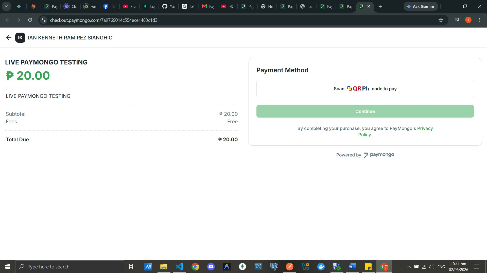
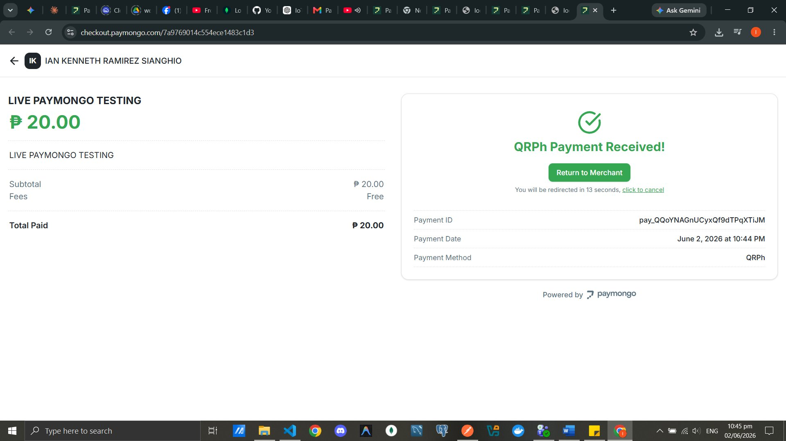
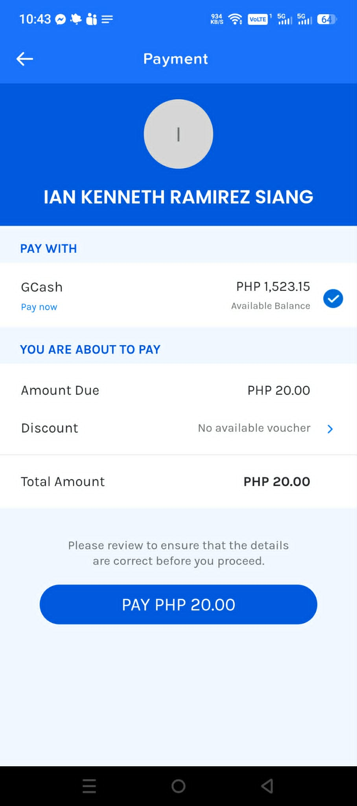
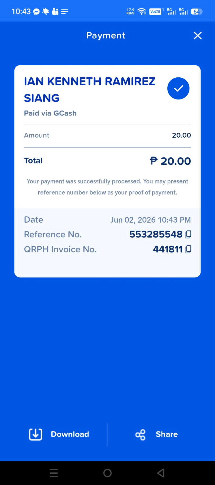
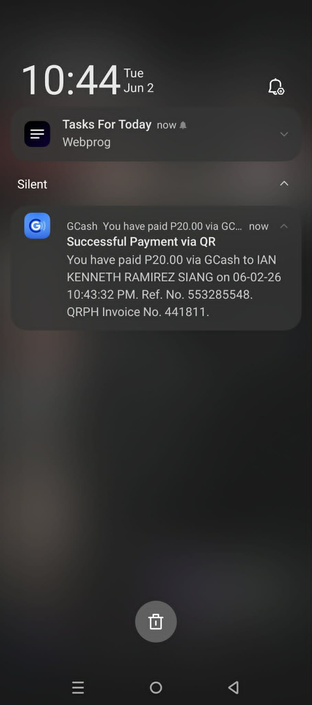
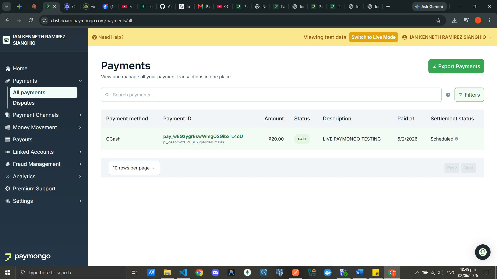
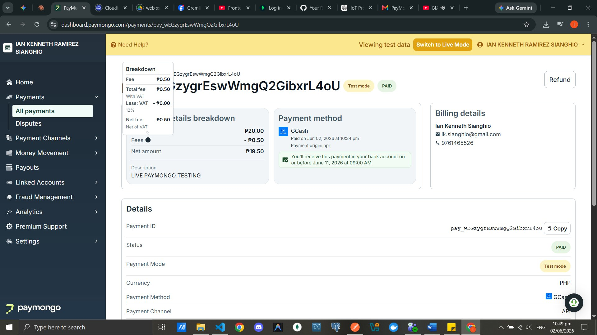

# PayMongo Payment Integration Demo

This module demonstrates a working **PayMongo** integration using **GCash / QRPh** as the payment method. All screenshots below are from a live test run on June 2, 2026.

---

## Overview

[PayMongo](https://www.paymongo.com) is a Philippine payment gateway that supports GCash, Maya, cards, and QRPh (InstaPay/PESONet via QR code). This demo walks through the full payment flow from checkout to confirmation.

| Field | Value |
|---|---|
| Amount | ₱20.00 |
| Payment Method | GCash / QRPh |
| Currency | PHP |
| Status | PAID |
| Description | LIVE PAYMONGO TESTING |

---

## Payment Flow

### 1. Checkout Page — Select QRPh Payment Method

The user lands on a PayMongo-hosted checkout page at `checkout.paymongo.com/{session_id}`. The right panel prompts them to **Scan QRPh code to pay**.

- Order summary on the left (subtotal, fees — Free in this case)
- Payment method panel on the right with a **Continue** button

> **Tip:** PayMongo's hosted checkout handles the UI for you — no need to build a custom checkout UI unless you want full control.



---

### 2. Checkout Page — Payment Success

After scanning the QR code and completing payment, the same checkout URL updates to show the confirmation screen.



---

### 3. GCash Payment Authorization

The user selects **GCash** as the payment method inside the GCash app. The app shows:

- Merchant name: **IAN KENNETH RAMIREZ SIANG**
- Available GCash balance
- Amount due: **PHP 20.00**
- A **PAY PHP 20.00** confirmation button



---

### 4. Payment Confirmation (GCash App)

After tapping pay, GCash shows a success receipt:

```
Amount:          ₱20.00
Date:            Jun 02, 2026 10:43 PM
Reference No.:   553285548
QRPH Invoice No: 441811
```



A push notification is also sent:



> *"Successful Payment via QR — You have paid P20.00 via GCash to IAN KENNETH RAMIREZ SIANG on 06-02-26 10:43:32 PM."*

---

### 5. PayMongo Checkout Success Screen

The checkout page updates to show:

```
✅ QRPh Payment Received!

Payment ID:     pay_QQoYNAGnUCyxQf9dTPqXTiJM
Payment Date:   June 2, 2026 at 10:44 PM
Payment Method: QRPh
```

The user is automatically redirected back to the merchant app after a short countdown.

---

### 6. PayMongo Dashboard — Payments List

In the PayMongo dashboard under **Payments → All Payments**, the transaction appears:



| Payment Method | Payment ID | Amount | Status | Description | Paid At | Settlement |
|---|---|---|---|---|---|---|
| GCash | `pay_wEGzygrEswWmgQ2GibxrL4oU` | ₱20.00 | PAID | LIVE PAYMONGO TESTING | 6/2/2026 | Scheduled |

---

### 7. PayMongo Dashboard — Payment Detail & Fee Breakdown

Clicking into the payment shows the full breakdown:



| | |
|---|---|
| **Amount** | ₱20.00 |
| **Fee** | - ₱0.50 |
| **Net Amount** | ₱19.50 |
| **VAT (12%)** | - ₱0.00 |
| **Net Fee** | ₱0.50 |

- **Billing:** Ian Kenneth Sianghio · ik.sianghio@gmail.com · 9761465526  
- **Settlement:** Expected on or before **June 11, 2026 at 09:00 AM**

---

## QRPh QR Code

The QR code below was used for the QRPh payment flow. It encodes the PayMongo payment intent and can be scanned with any InstaPay-compatible app (GCash, Maya, etc.).


---

## Key Takeaways

- PayMongo handles the entire hosted checkout — minimal frontend work required
- GCash payments via QRPh are near-instant; the webhook fires within seconds
- Fees are **₱0.50 flat** for this transaction (may vary by payment method and volume)
- Settlement is **T+7 business days** by default (scheduled payout)
- Both **Test mode** and **Live mode** are available in the dashboard

---

## Related

- [PayMongo Docs](https://developers.paymongo.com)
- [PayMongo Dashboard](https://dashboard.paymongo.com)
- [GCash Developer Portal](https://developer.gcash.com)
